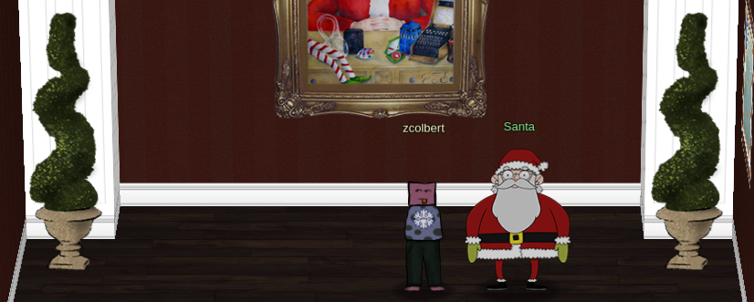
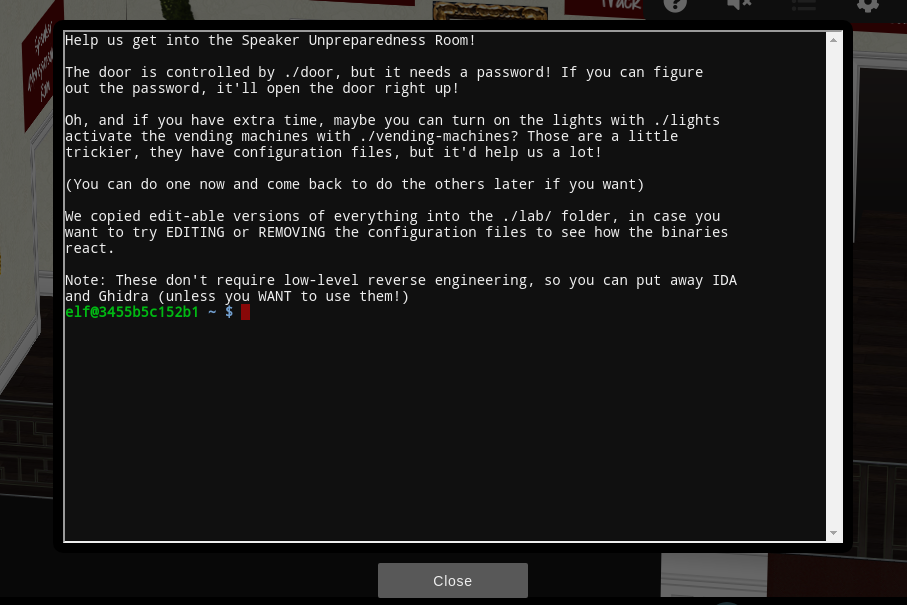

Christmas came and went pretty quickly this year, but I've kept Santa Claus on my mind by taking part in the [SANS Holiday Hack Challenge 2020](https://holidayhackchallenge.com/2020/). This _free_ CTF and virtual conference, put on by the cyber research and training SANS Institute, has been a spectacular learning resource and really fun challenge for me since it opened in early December.

_KringleCon 3: French Hens_ features several talks on tools, techniques, and common vulnerabilities. Some talks are much more technical than others, but even as someone who hasn't yet broken into the cybersecurity field I got a lot out of them. All of the talks, including those from previous years, are available for free on the [KringleCon YouTube channel](https://www.youtube.com/channel/UCNiR-C_VXv_TCFgww5Vczag). There's a little bit of everything here; from RFID hacking to attacks on pseudo-random number generators, to red-teaming and blog-writing. (Shout out to Jack Rhysider, host of the _Darknet Diaries_ podcast, for motivating me to continue writing for this blog!)

The CTF has an entire narrative and game based at the North Pole. You get to meet Santa and the elves, explore Kringle Castle, and hack away at some interesting challenges. There is a series of primary objectives to complete, as well as side challenges that are often equally challenging and educational. One advantage to completing side challeneges is that the elves presenting each challenge will give you useful hints for the primary objectives; that said, there are at least a couple of side challeneges that I still haven't completed because they were too hard :sweat_smile:

Participants get to submit a report with their findings for each objective, and can enter to win a set of prizes. The deadline for the 2020 challenge was extended to January 11, 2021, so I'm planning on posting some walkthroughs after that date has passed. Check this page again later!

Sound interesting? I _highly_ encourage everyone to try the [Holiday Hack](https://holidayhackchallenge.com/)! Even if you can't get a report in by the deadline, this year's challenge and challenges from previous years are still available to play online. Since this is my first #HolidayHack, I'll definitely be visiting older challenges for practice later.
