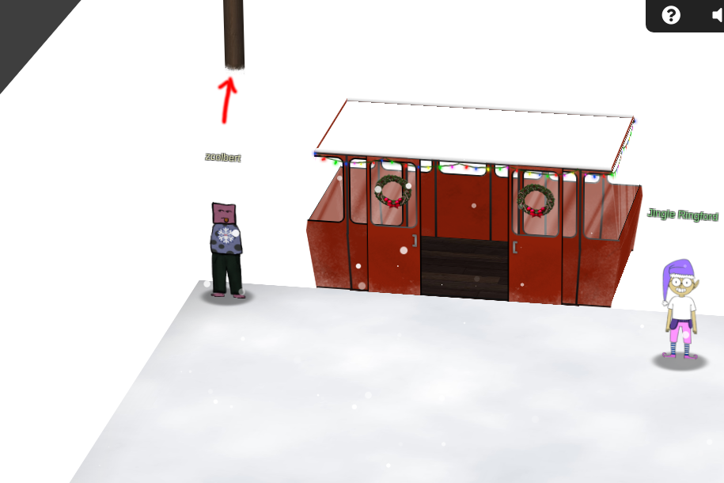

After signing on to attend my first KringleCon, naturally I was very excited. I ran straight to the cable car, and made my way up to Kringle Castle to have a look around! I met some of the elves in the courtyard, and started helping them with various issues they were experiencing (_Achievements_ coming soon). 

Once I had found my feet, I took a look at the first objective.

## The Objective
> There is a photo of Santa's Desk on that billboard with his personal gift list. What gift is Santa planning on getting Josh Wright for the holidays? Talk to Jingle Ringford at the bottom of the mountain for advice.

Billboard? Bottom of the mountain? I have to go _back_?

Down the hill I went, in search of a billboard.

<!-- USE ELEMENTS INSTEAD OF SOURCES. YOU CAN FIND A FULL_RESOLUTION IMAGE -->

I searched each corner of the landing, and it seems that only the base of the billboard is visible within my browser's viewport. By design? Perhaps. Can this obstacle be overcome? Of course!

_Right-click, Inspect, Sources._ I searched through the page's assets for a moment, and found it!

There was a new problem. Part of the image is twisted, so I couldn't read Santa's list. I don't have Photoshop, but an elf by the name of Jingle Ringford told me about an [online tool](https://www.photopea.com/) that sounded useful. I save the image, and upload it to the editor.

