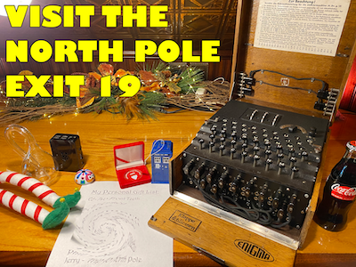
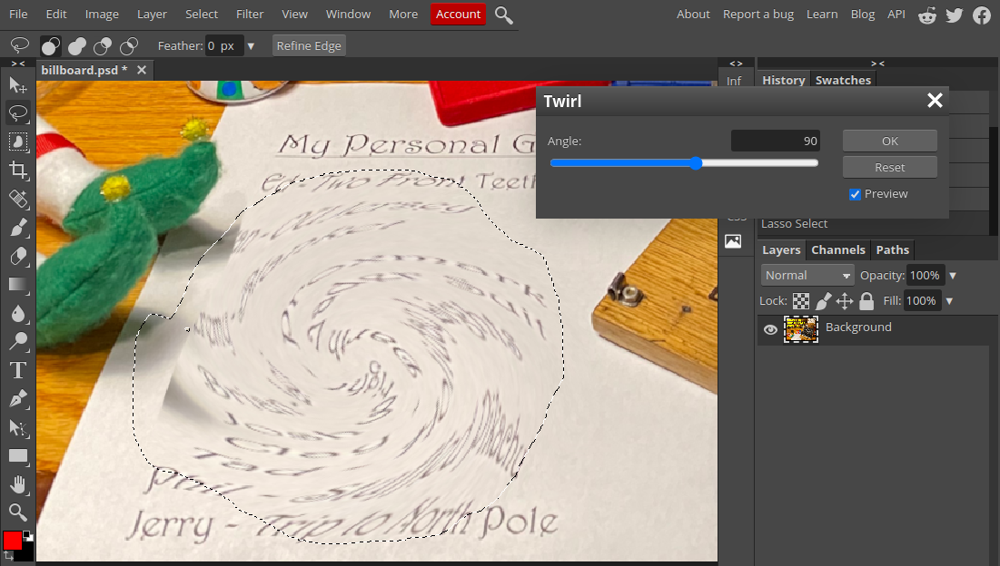

We start this objective at the base of the mountain, next to the gondola. I ended up wandering up to the castle before even looking at my badge, and had to ride the gondola back down &mdash; _so if you're at the castle, ride the gondola back to where you started to complete this objective._

The billboard falls outside the viewport of my browser, so I had to zoom out to see it. You could also use your browser's developer tools to look through the page's elements until you find one with class `billboard-sign`. Hover over the billboard to find that it's a link, and click the link to open the billboard image in a new tab.

With the full billboard image in front of us, we can now see that Santa's list has been distorted. You can probably get away with using your favorite image editor to undo the distortion, but I stuck with [Photopea](https://www.photopea.com/), as recommended in one of the hints from Jingle Ringford. Save the billboard image, and open it with the editor of your choice.

With the image open in your editor, use a lasso tool to select only the twisted area of the image. Then, use a twist filter to reverse-twist the selected area to make it readable (in Photopea you can find the appropriate effect under `Filter > Distort > Twirl`). I wasn't able to make a good enough selection to perfectly untwist the list, but by using a live preview of the twist filter I was able to read one or two words at a time until I pieced together the answer.

## Summary
There is a photo of Santa's Desk on that billboard with his personal gift list. What gift is Santa planning on getting Josh Wright for the holidays? Talk to Jingle Ringford at the bottom of the mountain for advice.

### Hints
#### 1. Image Edit Tool
There are [tools](https://www.photopea.com/) out there that could help Filter the Distortion that is this Twirl.
_&mdash; Jingle Ringford_

#### 2. Twirl Area
Make sure you Lasso the correct twirly area.
_&mdash; Jingle Ringford_

### Solution
1. At the bottom of the mountain, zoom out with your browser to find the billboard.
2. Click on the billboard to open it's image. Save the image.
3. Upload the image to [Photopea](https://www.photopea.com/) and lasso an area around the distorted part of the image.
4. Open the Twirl tool from the `Filter > Distort` menu.
5. Adjust the twirl of the lassoed area until you can read Josh Wright's name on the list. You may need to adjust it further to read the item next to Josh's name.
