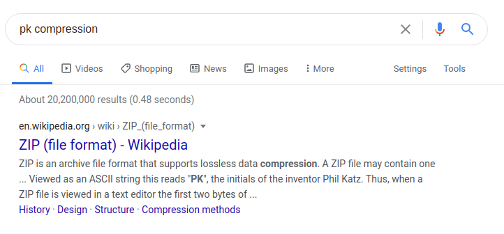

The second objective has us looking for the contents of a file in an exposed AWS Simple Storage Service (S3) bucket. For some important context, I recommend watching [this talk from Josh Wright](https://www.youtube.com/watch?v=t4UzXx5JHk0) before getting started.

## Find the Bucket
We know from Shinny Upatree that the file we're looking for is in an S3 bucket, but we don't know anything else about the bucket. The console provides us with the `bucket_finder.rb` script referenced in Josh's talk, so we can scan some buckets and find an accessible one.

Start by navigating to the `bucket_finder` directory. Create a wordlist with some possible names for the Wrapper3000 bucket, then run the script.
```shell
$ cd bucket_finder
$ vim wordlist

# Add some other possible names to the wordlist,
# save and exit Vim.

$ ./bucket_finder.rb wordlist
```

The results should look something like this:
```
http://s3.amazonaws.com/wrapper
http://s3.amazonaws.com/santa
Bucket santa redirects to: santa.s3.amazonaws.com
http://santa.s3.amazonaws.com/
        Bucket found but access denied: santa
...
```
with an entry for each of the names in your wordlist. The results here are pretty distinctly not what we're looking for; the `wrapper` bucket doesn't exist, and the `santa` bucket redirects to an existing bucket that we don't have access to. The goal of this objective isn't to break into a properly-secured S3 bucket, so we can ignore results that look like this.

Eventually you'll guess the correct name, and get a result that looks like this:
```
http://s3.amazonaws.com/wrapper3000
Bucket Found: wrapper3000 ( http://s3.amazonaws.com/wrapper3000 )
        <Public> http://s3.amazonaws.com/wrapper3000/package
```

## Download Contents of the Bucket
Now that we've found the bucket we're looking for, we can use `bucket_finder.rb` to easily download it's contents.
```shell
# Create a one-off wordlist and run the script
# with the --download option to download bucket contents
$ echo "wrapper3000" > target
$ ./bucket_finder.rb target --download

# Copy package file to the home directory for 
# further work
$ cp wrapper3000/package ~
```

## Unwrap the Package
The message of the day and the objective both indicate that we're not done here &mdash; we haven't donwloaded a cleartext file with the string we're searching for. If you `cat` the file as it is now, you'll get gibberish.

To unwrap the file, we need to make a series of educated guesses as to what was done to the original file that resulted in what we're looking at, undoing each layer of "wrapping."

### 1. Encoding
```
UEsDBAoAAAAAAIAwhFEbRT8anwEAAJ8BAAAcABwAcGFja2FnZS50eHQuWi54ei54eGQudGFyLmJ6MlVUCQADoBfKX6AXyl91eAsAAQT2AQAABBQAAABCWmg5MUFZJlNZ2ktivwABHv+Q3hASgGSn//AvBxDwf/ ...
```

The first thing that occurs to me when I look at this output is that it's made up entirely of _printable_ characters. If we were looking at an executable or most other encrypted/compressed formats, there would be at least some bytes that can't be rendered as letters and numbers. _Base n_ encodings, however, use printable characters to represent bytes as text.

How can we tell which base this content is encoded in? Each encoding uses a specific set of characters to represent data. For example, the following are a few encodings of the same data:

| Encoding    | Base  | Value     |
| ----------- | ----- | --------- |
| Decimal     | 10    | 12        |
| Binary      | 2     | 00001100  |
| Hexadecimal | 16    | 0C        |

Notice that the decimal representation uses whole numbers `0-9`. Binary uses `0` and `1` only. Hexadecimal uses numbers `0-9` and letters `A-F` (to represent numbers up to 15 in one character). Higher base encodings make further use of letters and symbols to represent larger numbers in fewer characters.

Our data includes numbers, upper and lowercase letters, and some special characters; this rules out base 16. Base 32 also doesn't use special characters. The next most common encoding that does use special characters is base 64.

Use the `base64` utility to decode the contents of the file:
```shell
$ base64 -d package
```
At first, the output of decoding looks like gibberish also. Look closer, and you'll find that there's a filename near the beginning and end of the output! Some readable information coming out in the decoded data is a good indication, so let's save this to a file and carry on.
```shell
$ base64 -d package > package.txt.Z.xz.xxd.tar.bz2.idk
```

### Compression
We've gleaned a filename from the data in our new file, but we can't jump straight to `bz2`. Try it, and you'll get an error. Clearly, there's another layer of wrapping in between us and the file formats that we can now read in the binary.

Binary output and the inclusion of an input filename makes me think that we could be looking at compressed data. But there are several different compression utilities out there, and I don't want to waste time trying all of them to see which works. To get a better read of the data and see if there's anything else interesting, we'll use the `hexdump` utility.
```shell
$ hexdump -C package.txt.Z.xz.xxd.tar.bz2.idk
00000000  50 4b 03 04 0a 00 00 00  00 00 80 30 84 51 1b 45  |PK.........0.Q.E|
00000010  3f 1a 9f 01 00 00 9f 01  00 00 1c 00 1c 00 70 61  |?.............pa|
00000020  63 6b 61 67 65 2e 74 78  74 2e 5a 2e 78 7a 2e 78  |ckage.txt.Z.xz.x|
00000030  78 64 2e 74 61 72 2e 62  7a 32 55 54 09 00 03 a0  |xd.tar.bz2UT....|
00000040  17 ca 5f a0 17 ca 5f 75  78 0b 00 01 04 f6 01 00  |.._..._ux.......|
...
```

The first few bytes of a file are often a _magic number_, used to denote the file format. The first two bytes of this file come out as printable characters `PK`, and a quick Google search for _PK compression_ gives us our answer!


Let's rename our file to reflect our guess at the file format, then uncompress it with a ZIP utility.
```shell
$ mv package.txt.Z.xz.xxd.tar.bz2.idk package.txt.Z.xz.xxd.tar.bz2.zip

$ unzip package.txt.Z.xz.xxd.tar.bz2.zip
# result: new file package.txt.Z.xz.xxd.tar.bz2
```


### More Compression!
Assuming that this file wasn't wrapped with false file extensions in order to throw us off, unwrapping the file from here is relatively simple. At each step, we only need to interpret the file extension and find an appropriate utility with which to uncompress or decode it.

For brevity, here are all of the remaining layers and utilities for unwrapping them:
```shell
# uncompress bz2
$ bzip2 -d package.txt.Z.xz.xxd.tar.bz2

# uncompress tar archive
$ tar -xvf package.txt.Z.xz.xxd.tar

# reverse hex dump
$ xxd -r package.txt.Z.xz.xxd > package.txt.Z.xz

# uncompress 7zip
$ 7zr e package.txt.Z.xz

# uncompress UNIX compression
$ uncompress package.txt.Z

# all done!
$ cat package.txt
```


## Summary
When you unwrap the over-wrapped file, what text string is inside the package? Talk to Shinny Upatree in front of the castle for hints on this challenge.

### Relevant Talks
[Josh Wright, Open S3 Buckets: Still a Problem In 2020 | KringleCon 2020](https://www.youtube.com/watch?v=t4UzXx5JHk0)

### Hints
Shinny Upatree will give you five useful hints upon completion of the Kringle Kiosk challenge.

#### 1. Find Santa's Package
Find Santa's package file from the cloud storage provider. Check Josh Wright's [talk](https://www.youtube.com/watch?v=t4UzXx5JHk0) for more tips!


#### 2. Leaky AWS S3 Buckets
It seems like there's a new story every week about data exposed through unprotected [Amazon S3 buckets](https://www.computerweekly.com/news/252491842/Leaky-AWS-S3-bucket-once-again-at-centre-of-data-breach).


#### 3. Finding S3 Buckets
Robin Wood wrote up a guide about [finding these open S3 buckets](https://digi.ninja/blog/whats_in_amazons_buckets.php).


#### 4. Bucket_finder.rb
He even wrote a tool to search for [unprotected buckets](https://digi.ninja/projects/bucket_finder.php)!


#### 5. Santa's Wrapper3000
Santa's Wrapper3000 is pretty buggy. It uses several compression tools, binary to ASCII conversion, and other tools to wrap packages.


### Solution
1. Write a wordlist and use `bucket_finder.rb` to find the exposed public S3 bucket for the Wrapper3000.
2. Download the contents of the bucket and make a working copy of the `package` file.
3. Use the following utilities (in order) to unwrap the package:
    1. `base64` (decode)
    2. `unzip`
    3. `bzip2` (uncompress)
    4. `tar` (extract)
    5. `xxd` (reverse dump)
    6. `7zr` (extract)
    7. `uncompress`
4. Read the contents of the resulting file.