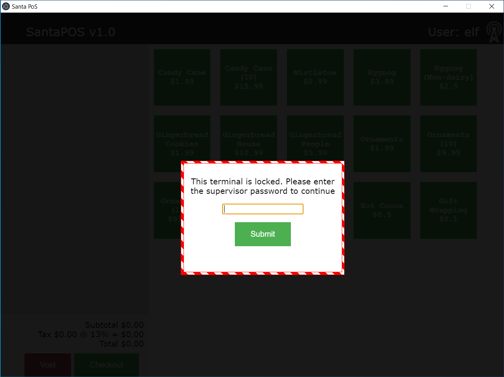

The third objective will have us digging into the source code of an Electron app to find a hard-coded password. _Note: I wasn't able to run the provided Electron app on my Linux system (with Wine), so some of this guide will require a Windows system._


<!-- TOC depthTo:3 -->

- [About Electron](#about-electron)
- [Getting Started](#getting-started)
- [Extracting Source Code](#extracting-source-code)
- [Summary](#summary)
  - [Hints](#hints)
  - [Solution](#solution)

<!-- /TOC -->


## About Electron
Electron is a software framework for building desktop applications with Javascript, HTML, and CSS. It's become increasingly popular in recent years because it enables people with web development experience to apply the skills they already have to building desktop apps. Where developers used to need entirely different languages and frameworks to build applications for desktop and the web, now they can get away with just JS, HTML, and CSS.

Electron runs on Chromium, the open-source browser project sponsored by Google; and Node.js, a command-line Javascript runtime. When you build a desktop app with Electron, you're effectively building a web app. Your packaged application will run out of a Chromium browser that's dressed up to look like any old desktop application.


## Getting Started


Start this objective on a Windows system. Log into KringleCon and visit Sugarplum Mary's POS workstation to download `santa-shop.exe`. Run the file, and you'll find that it installs the `santa-shop` point-of-sale app. You can try plugging passwords into the app, but it's not worth sitting here and guessing all day.



Take a quick look through the [ASAR extraction guide](https://medium.com/how-to-electron/how-to-get-source-code-of-any-electron-application-cbb5c7726c37) from the hints. We're looking for a file named `app.asar` in the internals of the application; the guide shows us exactly where to find that file on macOS, but doesn't help us out on the Windows side.

The easiest way I can think of to find the internals for any application on Windows is to follow links from the Start Menu. Pop open your Start Menu, and you should see the app right at the top of the list, under _Recently added_. Right-click on the app, and click `More > Open file location`.


In most cases, Start Menu entries are a shortcut to an executable. To get to the executable and other internals, right-click on the shortcut and click `Open file location` again.


Now we're getting somewhere! These are the core files that make the Electron app work, found at `%userprofile%\AppData\Local\Programs\santa-shop`.


Take a look under the `resources` folder, similarly to the ASAR extraction guide, and you'll find the `app.asar` file.


## Extracting Source Code
Now that we have `app.asar` &mdash; and to avoid installing Node.js on a Windows system that I borrowed &mdash; I moved the file back over to my Linux system.

At this stage, you'll want to stop and install Node.js if you don't already have it.

Picking up again with the guide, install the `asar` package.
```shell
$ npm install -g asar
```

Then, in the working directory with the `app.asar` file, we'll create a folder and extract source code into it.
```shell
$ mkdir src && asar extract app.asar src
$ cd src && ls -l
total 36
drwxr-xr-x 2 colbertz colbertz 4096 Jan 14 13:13 img
-rw-r--r-- 1 colbertz colbertz 1284 Jan 14 13:13 index.html
-rw-r--r-- 1 colbertz colbertz 2713 Jan 14 13:13 main.js
-rw-r--r-- 1 colbertz colbertz  202 Jan 14 13:13 package.json
-rw-r--r-- 1 colbertz colbertz  138 Jan 14 13:13 preload.js
-rw-r--r-- 1 colbertz colbertz   79 Jan 14 13:13 README.md
-rw-r--r-- 1 colbertz colbertz 5984 Jan 14 13:13 renderer.js
-rw-r--r-- 1 colbertz colbertz 3801 Jan 14 13:13 style.css
```

Now, where to look for a password? Let's start with `README.md` to see if there's anything useful there.
```shell
$ cat README.md
Remember, if you need to change Santa's passwords, it's at the top of main.js!
```

I think you know what to do from here.


## Summary
Help Sugarplum Mary in the Courtyard find the supervisor password for the point-of-sale terminal. What's the password?

### Hints
Sugarplum Mary will give you two useful hints upon completing the Linux Primer challenge.

#### 1. Electron Applications
It's possible to extract the source code from an [Electron](https://www.electronjs.org/) app.

#### 2. Electron ASAR Extraction
There are [tools](https://www.npmjs.com/package/asar) and [guides](https://medium.com/how-to-electron/how-to-get-source-code-of-any-electron-application-cbb5c7726c37) explaining how to extract ASAR from Electron apps.

### Solution
1. _On Windows,_ download `santa-shop.exe` from Sugarplum Mary's workstation and run it.
2. Navigate to `%userprofile%\AppData\Local\Programs\santa-shop\resources` and copy `app.asar` to a working directory.
3. Install the `asar` package.
```shell
$ npm install -g asar
```

4. Extract the app's source code into directory `src`.
```shell
$ mkdir src && asar extract app.asar src
```

5. Read the hard-coded password from the first few lines of `src/main.js`
