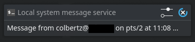
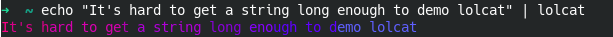
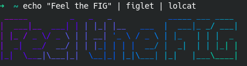
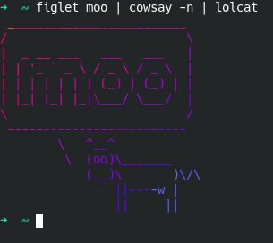
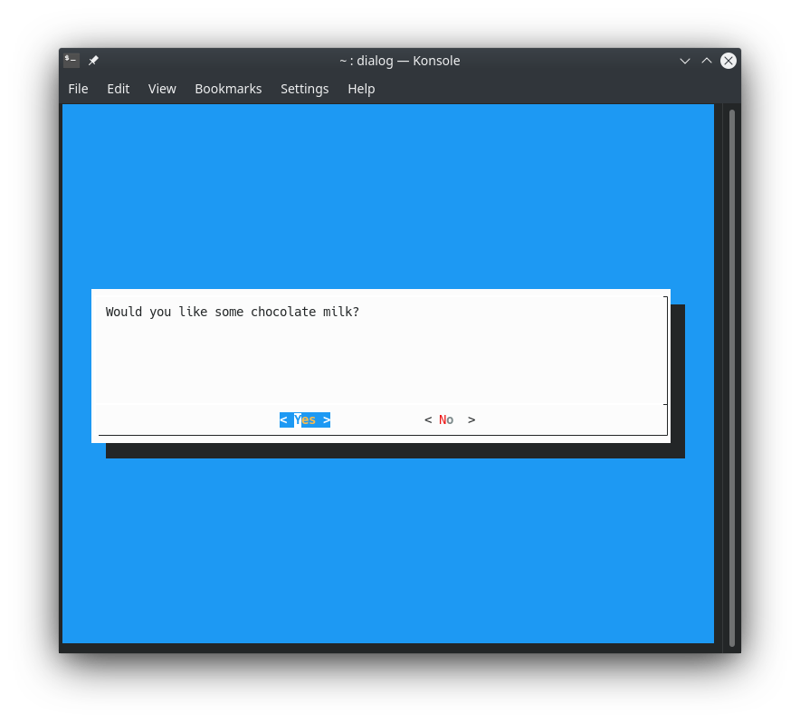
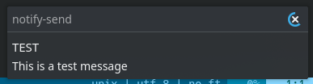

> This honestly started out as just some notes for myself when Googling for
> the `write` command, but I got so into the groove of writing that I figured
> it wouldn't be hard to turn this into a full-blown post about some of my
> favorite useful (and goofy) tools for the command line.

Cliff Stoll often refers to messages "flashed" to one user or another's
terminal in his book "The Cuckoo's Egg." Stoll works exclusively with Unix
systems in the book, so I started looking for ways to accomplish this on a
modern Linux system.

[StackOverflow provides.](https://unix.stackexchange.com/questions/144924/how-can-i-create-a-message-box-from-the-command-line)

## The Real Answer: `write`

This is almost certainly the tool that Cliff would have been using in the 80s.
And the syntax is so simple!

```shell
# Interactively...
write <username> [<terminal>]

# or with a pipe
echo "message" | write <username>
```

### There's a problem...

I tried it out! Here's what I got:

```shell
$ write colbertz		# that's my username
write: you have write permission turned off
```

Okay... I didn't do that. So it must be a default. The man page for `write`
pointed me to the `mesg` command, which is made to "display (or do not
display) messages from other users."

Cool, so `mesg y` enables messages. Try again:

```shell
# Enable users to write to my terminal
$ mesg y

# Try writing to myself again
$ write colbertz
write: colbertz is logged in more than once; writing to pts/0
```

### Another unexpected thing!

My desktop environment gave me a notification!



The notification shows that `colbertz` sent me a message from terminal `pts/2`.
Which raises the question: where is `pts/0`? You see, I have three terminals
open that I'm aware of:

- The terminal that I used to execute `write`
- The terminal that I'm writing this note in
- A hidden Yakuake terminal that runs in the background

Presumably I also have a session somewhere in the background that's running my
desktop environment (I think that's how that works). I love that the DE is
sending me notifications when I get messages from myself, but I'd also love to
know where they are actually going, and how the DE knows where to listen.

`who` shows me that I have four terminals running:

```shell
$ who
colbertz	tty1
colbertz	pts/0
colbertz	pts/1
colbertz	pts/2
```

We know already that `pts/2` is the terminal that sent the message. Cool.

The `tty` command prints "the file name of the terminal connected to standard
input." Sounds like what we're looking for, so I'll test it out on the terminal
I already know.

```shell
$ tty
/dev/pts/2
```

Huzzah! Another useful tool I discovered while Googling is `w`, which is very
similar to `who`. The `w` utility shows "who is logged on and what they are
doing," so if I know what process is running in each terminal I can take a good
guess at which is which. For example, on my system:

```shell
$ w
 14:28:48 up  2:01,  4 users,  load average: 0.19, 0.34, 0.49
USER     TTY        LOGIN@   IDLE   JCPU   PCPU WHAT
colbertz pts/0     12:42    1:46m  0.00s  3.79s /usr/bin/kded5
colbertz tty1      12:42    2:01m  4:54   0.01s /usr/bin/startplasma-x11
colbertz pts/1     12:42   13:18   0.31s  0.31s /usr/bin/zsh
colbertz pts/2     12:42    1:42m  4.54s  4.36s vim /home/colbertz/notes/research/misc/sending messages to unix users
```

I can put these together pretty easily.

| TTY   | Process                  | Description                                                           |
| ----- | ------------------------ | --------------------------------------------------------------------- |
| tty1  | /usr/bin/startplasma-x11 | Kernel-emulated "physical" terminal, running my desktop environment   |
| pts/0 | /usr/bin/kded5           | Virtual terminal, also running my DE? Perhaps my actual user session. |
| pts/1 | /usr/bin/zsh             | Yakuake terminal, which I keep running in the background.             |
| pts/2 | vim /home/colbertz...    | The terminal I'm writing this up in!                                  |

So back to the spoopy notification that my DE gave me... this makes sense. If
pts/0 is running KDE Plasma, then messages sent to that terminal presumably get
caught by some KDE feature and turned into a graphical desktop notification.

Neat!

## Other Cool Tools

Some cool tools I discovered along the way, and a couple I already know and
love.

### Administrative Tools

#### mesg

Display (or do not display) messages from other users.

Example:

```
Allow users to send you messages
$ mesg y

Disallow users to send you messages
$ mesg n
```

#### who

Show who is logged on.

Example:

```
$ who
colbertz pts/0        2020-09-18 12:42 (:0)
colbertz tty1         2020-09-18 12:42 (:0)
colbertz pts/1        2020-09-18 12:42 (:0)
colbertz pts/2        2020-09-18 12:42 (:0)
```

#### w

Show who is logged on and what they are doing.

Example:

```
$ w
 15:12:24 up  2:45,  4 users,  load average: 0.18, 0.31, 0.29
USER     TTY        LOGIN@   IDLE   JCPU   PCPU WHAT
colbertz pts/0     12:42    2:29m  0.00s  6.07s /usr/bin/kded5
colbertz tty1      12:42    2:45m  5:59   0.01s /usr/bin/startplasma-x11
colbertz pts/1     12:42   13:39   0.42s  0.42s /usr/bin/zsh
colbertz pts/2     12:42   15:52   7.21s  7.01s vim /home/colbertz/notes/research/misc/sending messages to unix users
```

#### tty

Print the file name of the terminal connected to standard input.

Example:

```
$ tty
/dev/pts/1
```

#### wall

Write a message to all users.

_Note: Only the superuser can write on the terminals of users who have chosen to
deny messages._

Example:

```
$ wall "This is a test"
```

In another terminal:

```
Broadcast message from colbertz@hostname (pts/3) (Fri Sep 18 15:14:58 2020):

This is a test
```

### Text Utilities / Text-Based Graphics

#### boxes

Text mode box and comment drawing filter.

Example:

```
$ echo "This is a test" | boxes
/******************/
/* This is a test */
/******************/
```

`boxes` has soooo much more functionality than I'm going to cover here. The most
basic usage seems like it would be neat for header comments in C/C++ files though!

#### cowsay/cowthink

Configurable speaking/thinking cow (and a bit more).

Examples:

```
$ echo "This is a test" | cowsay
 ________________
< This is a test >
 ----------------
        \   ^__^
         \  (oo)\_______
            (__)\       )\/\
                ||----w |
                ||     ||
$ cowsay moo
 _____
< moo >
 -----
        \   ^__^
         \  (oo)\_______
            (__)\       )\/\
                ||----w |
                ||     ||
$ cowthink moo
 _____
( moo )
 -----
        o   ^__^
         o  (oo)\_______
            (__)\       )\/\
                ||----w |
                ||     ||
```

&#x2665; cowsay

#### figlet

Display large characters made up of ordinary screen characters.

Example:

```
$ echo "love FIGlet" | figlet
 _                  _____ ___ ____ _      _
| | _____   _____  |  ___|_ _/ ___| | ___| |_
| |/ _ \ \ / / _ \ | |_   | | |  _| |/ _ \ __|
| | (_) \ V /  __/ |  _|  | | |_| | |  __/ |_
|_|\___/ \_/ \___| |_|   |___\____|_|\___|\__|

$ figlet "Feel the FIG"
 _____         _   _   _            _____ ___ ____
|  ___|__  ___| | | |_| |__   ___  |  ___|_ _/ ___|
| |_ / _ \/ _ \ | | __| '_ \ / _ \ | |_   | | |  _
|  _|  __/  __/ | | |_| | | |  __/ |  _|  | | |_| |
|_|  \___|\___|_|  \__|_| |_|\___| |_|   |___\____|

```

#### toilet

Display large and colourful characters.

`toilet` is marketed as an alternative to figlet. As a figlet fan, I'm not sure
why we needed this.

Example:

```
$ toilet "Flush"

 mmmmmm ""#                  #
 #        #    m   m   mmm   # mm
 #mmmmm   #    #   #  #   "  #"  #
 #        #    #   #   """m  #   #
 #        "mm  "mm"#  "mmm"  #   #
```

Okay, then.

#### lolcat

Rainbow coloring effect for the text console display.

Examples:


But honestly, the best way to use `lolcat` is on a pipeline with `figlet`:


But _actually_, it doesn't get better than `figlet` + `cowsay` + `lolcat`:


#### dialog

Display dialog boxes from shell scripts.

Another dialog box tool with _many_ options, except this one gives you that
retro terminal GUI you have probably seen used by old OS installers (or some
modern server OS installers)! I'll implement the same example I used for
`zenity`.

Example:

```
$ dialog --yesno "Would you like some chocolate milk?" 10 80
$ echo $?
```

In this case, `dialog` requires that we provide the height (10) and width (80)
of the dialog box, as well as the question text. As with `zenity`, it will
return 0 for yes and 1 for no.



#### whiptail

I couldn't find a `whiptail` package for Manjaro/Arch, so I have nothing to say
except that it's a replacement for `dialog`. Sounds like you Debian users have
it installed by default.

### GUI Utilities

#### notify-send

A program to send desktop notifications.

Example:

```
$ notify-send "TEST" "This is a test message"
```

The result on my Manjaro (KDE Plasma) system:


#### zenity

Display GTK+ dialogs.

This is another tool that has _far_ too many options for me to cover it in
detail! Definitely check out the man page for more information. This is one that
I will be keeping in my back pocket for future scripts/programs.

Example: I'm going to display a yes/no dialog with some custom text, then check
the user's response.

```
$ zenity --question --text="Would you like some chocolate milk?"
$ echo $?
```

If the user clicks _Yes_ then `echo $?` will print a 0 to the console. If the
users click _No_ it will print a 1. Here's how that dialog looks on my system:


I'm pretty confident I know the answer to this question.

#### xmessage

Display a message or query in a window (X-based /bin/echo)

Sounds fun! It's like echo but... in a window.

Example:

```
$ xmessage "This is a test"
Warning: Unable to load any usable ISO8859 font
[1]		39557 segmentation fault (core dumped)	xmessage "This is a test"
```

Well that's awkward.
